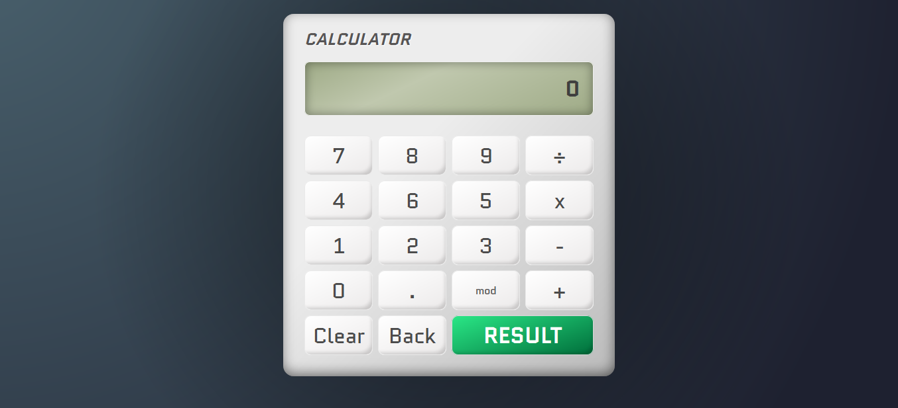

# Basic Vue.js Calculator
This is my second exercise to learn Vue.js and Javascript, a simple calculator stylized with **CSS3**:

---
No images it was used in this app, only CSS.

---

The logic can be improved, but for learning purposes it was good in many points!
